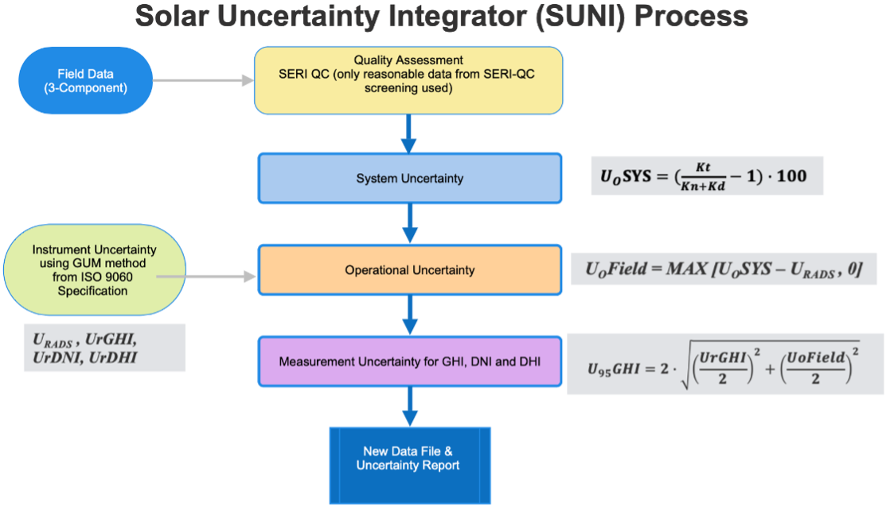

# SUNI

Solar Uncertainty Integrator (SUNI) estimates uncertainty for high-resolution,
subhourly solar irradiance datasets. The framework combines quality screening
from [SERI QC](https://docs.nrel.gov/docs/legosti/old/5608.pdf) with radiometer measurement uncertainty modeling to produce
uncertainty-annotated outputs and summary reports.

## Background

The Solar Uncertainty Integrator (SUNI) software adheres to the internationally
accepted Guide to the Expression of Uncertainty in Measurement (GUM). The SUNI
software, has been specifically designed to integrate data quality analyses and
radiometer measurement uncertainty estimates for global horizontal irradiance
(GHI), direct normal irradiance (DNI), and diffuse horizontal irradiance (DHI).

As the global demand for solar energy sources continues to increase, accurate
and reliable solar irradiance data have become increasingly essential for the
successful implementation and optimization of solar energy systems. From
evaluating project feasibility to monitoring system performance, accurate
measurements of solar radiation play an essential role in both research and
practical applications. The quantification and transparent reporting of
measurement uncertainty is a critical component of solar resource assessment.
Recognizing this need, the National Laboratory of the Rockies (NLR) developed
SUNI, a Python-based software tool designed to systematically estimate the
measurement uncertainty in accordance with the internationally accepted GUM
method. SUNI enables users to evaluate uncertainty in GHI, DNI, and DHI at time
intervals ranging from 1 minute to 1 hour, making it suitable for a wide array
of applications and datasets.

The SUNI software package provides a method to assign expanded uncertainty
estimates to three-component solar radiation measurements (Wilcox et al. 2025).
The system merges static uncertainty information about radiometer performance
with the dynamic operational uncertainty information extracted from the data
quality assessment (Maxwell, Wilcox, and Rymes 1994). As shown in the flowchart
below, the SUNI software handles three-component datasets for GHI, DNI, and DHI.
These three components are then assessed for data quality to identify a
reasonable dataset using the SERI-QC software. The SERI-QC software is a
well-established automated data quality assessment tool based on the fraction of
incident extraterrestrial irradiance (Maxwell, Wilcox, and Rymes 1994) and the
three irradiance components to estimate the clearness index. Similarly, the
system uncertainty is estimated using the closure equation of the clearness
index, namely, $K_{t}$ for GHI, $K_{n}$ for DNI, and $K_{d}$ for DHI. A ratio based on this
closure equation is considered a system uncertainty, as described in the
flowchart below.

Instrument uncertainty is a key in the SUNI process. Instrument uncertainty is
an inherent radiometer uncertainty derived from the radiometer specification.
These specifications can be obtained from the manufacturer and/or from ISO 9060
(ISO 2018). Moreover, the inherent uncertainty is estimated by following the
GUM. The application of the GUM method is documented in (Reda 2011; ASTM 2017;
Aron Habte et al. 2014; Konings and Habte 2016). Similarly, operational
uncertainty, also known as field uncertainty ($U_{o} Field$), is calculated from the
system uncertainty ($U_{o} SYS$) and the inherent radiometer uncertainty, as shown in
the flowchart below. The inherent radiometer uncertainty ($U_{r}$) for the
three-component dataset is defined as:

-   Uncertainty of GHI: $U_{r}GHI$
-   Uncertainty of DNI: $U_{r}DNI$
-   Uncertainty of DHI: $U_{r}DHI$

To separate the field uncertainty from the radiometer expanded uncertainties,
the method first establishes the collective expanded uncertainty for the
radiometers ($U_{RADS}$) by combining the three radiometer uncertainties in
quadrature:

$$
U_{RADS}=2\cdot\sqrt{\left(\frac{U_{r}GHI}{2}\right)^2+\left(\frac{U_{r}DNI}{2}\right)^2+\left(\frac{U_{r}DHI}{2}\right)^2}
$$

$U_{o} Field$, the uncertainty attributable to environmental and operational effects,
is then the difference between the absolute value of $U_{o} SYS$ and $U_{RADS}$:

$$
U_{o} Field=\max\left(|U_{o} SYS|-U_{RADS},0\right)
$$

The $\max$ function in the field uncertainty calculation sets negative values of $U_{o} Field$ 
to zero. In this arrangement, $U_{o} Field$ represents the uncertainty in $U_{o} SYS$ 
beyond that of the radiometer uncertainties. Combining $U_{o} Field$ with each
radiometer uncertainty in turn, the method estimates of the expanded uncertainty
for each of the three measured irradiance components:

$$
U_{95} GHI=2\cdot\sqrt{\left(\frac{U_{r}GHI}{2}\right)^2+\left(\frac{U_{o} Field}{2}\right)^2}
$$

$$
U_{95} DNI=2\cdot\sqrt{\left(\frac{U_{r}DNI}{2}\right)^2+\left(\frac{U_{o} Field}{2}\right)^2}
$$

$$
U_{95} DHI=2\cdot\sqrt{\left(\frac{U_{r}DHI}{2}\right)^2+\left(\frac{U_{o} Field}{2}\right)^2}
$$

The overall radiometer uncertainty is calculated by following the GUM method of
implementing the root-sum-square method. Details about the method are documented
in (Wilcox and Stoffel 2024; Wilcox et al. 2025).

A flow chart of SUNI software is given below:



<!-- ## Key Features

- Supports one-minute and other subhourly irradiance datasets
- Integrates SERI QC flags into uncertainty processing
- Produces CSV outputs with component-level uncertainty fields
- Generates human-readable processing reports
- Available as both a GUI application and a Python CLI workflow -->

## Installation

SUNI can be used through either the CLI or the GUI.

### CLI Installation

You can install with Pixi or Conda.

#### Using Pixi (recommended)
Make sure [Pixi](https://pixi.prefix.dev/latest/installation/) is first installed based on your operating system.

From the repository root:

```bash
cd CLI/
pixi install --frozen       # Install the default environment with the exact versions as defined in the `pixi.lock` file
pixi shell -e default       # Shell into the environment
suni --help                 # Confirm SUNI CLI is installed properly
```

#### Using Conda
Make sure [Conda](https://docs.conda.io/projects/conda/en/latest/user-guide/install/index.html) is first installed based on your operating system.

From the repository root:

```bash
conda create -n suni python=3.11 -y
conda activate suni
pip install -e ./CLI/SERIQC
pip install -e ./CLI/SUNI
```

Confirm the CLI is installed:

```bash
suni --help
```

### GUI Installation

1. Download the installer for your platform from this repository's Releases page.
2. Complete the installation and launch the SUNI application.
3. Use the example files in `examples/` to validate your first run.


## References

1. ASTM International. 2017. ASTM G213-17(2023), Standard Guide for Evaluating Uncertainty in Calibration and Field Measurements of Broadband Irradiance with Pyranometers and Pyrheliometers.
2. Habte, Aron. 2014. Radiometer Data Uncertainty Analysis. Spreadsheet for estimating radiometer uncertainties. Available from the NREL Measurement and Instrumentation Data Center: https://midcdmz.nlr.gov/radiometer_uncert.xlsx.
3. Habte, Aron, Manajit Sengupta, Ibrahim Reda, Afshin Andreas, and Jorgen Konings. 2014. Calibration and Measurement Uncertainty Estimation of Radiometric Data: Preprint. United States. https://www.osti.gov/biblio/1164884.
4. ISO. 2018. ISO 9060:2018, Solar energy - Specification and classification of instruments for measuring hemispherical solar and direct solar radiation.
5. Konings, Jorgen, and Aron Habte. 2016. Uncertainty Evaluation of Measurements with Pyranometers and Pyrheliometers. Presented at SWC 2015: ISES Solar World Congress, 8-12 November 2015, Daegu, Korea, United States. https://www.osti.gov/biblio/1352995.
6. Maxwell, E., S. Wilcox, and M. Rymes. 1993. Users Manual for SERI QC Software - Assessing the Quality of Solar Radiation Data. Golden, CO: National Renewable Energy Laboratory. NREL/TP-463-5608. http://www.nlr.gov/docs/legosti/old/5608.pdf.
7. Reda, Ibrahim. 2011. Method to Calculate Uncertainty Estimate of Measuring Shortwave Solar Irradiance using Thermopile and Semiconductor Solar Radiometers. National Renewable Energy Laboratory (NREL), Golden, CO (United States) (United States). https://www.osti.gov/biblio/1021250.
8. Wilcox, Stephen, and Thomas Stoffel. 2024. A Refined Method to Translate Solar Data Quality Assessment Flags to Estimated Measurement Uncertainty. National Renewable Energy Laboratory (NREL), Golden, CO (United States) (United States). https://www.osti.gov/biblio/2370496.
9. Wilcox, Stephen, Tom Stoffel, Manajit Sengupta, Aron Habte, Paul Pinchuk, and Steven Janzou. 2025. Deliverable 6.7 - Final Technical Report: Development Summary and Evaluation of the Solar Uncertainty Integrator (SUNI) Software. National Renewable Energy Laboratory.


## License and Citation

Please refer to repository licensing and project policy files for licensing terms and citation guidance.
