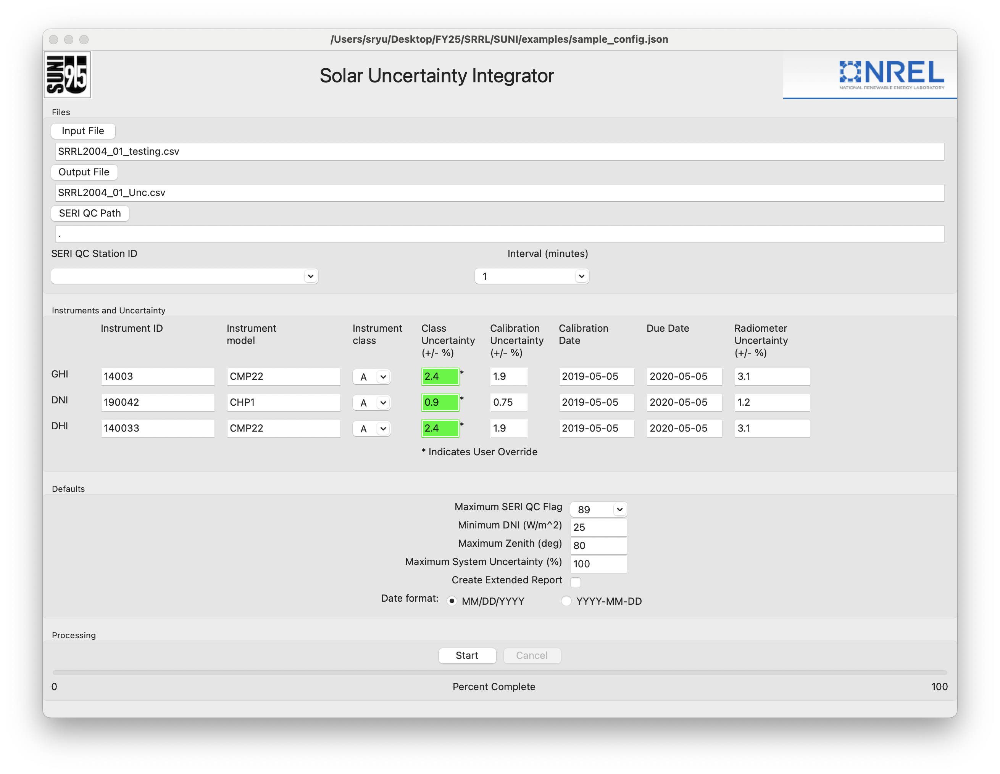
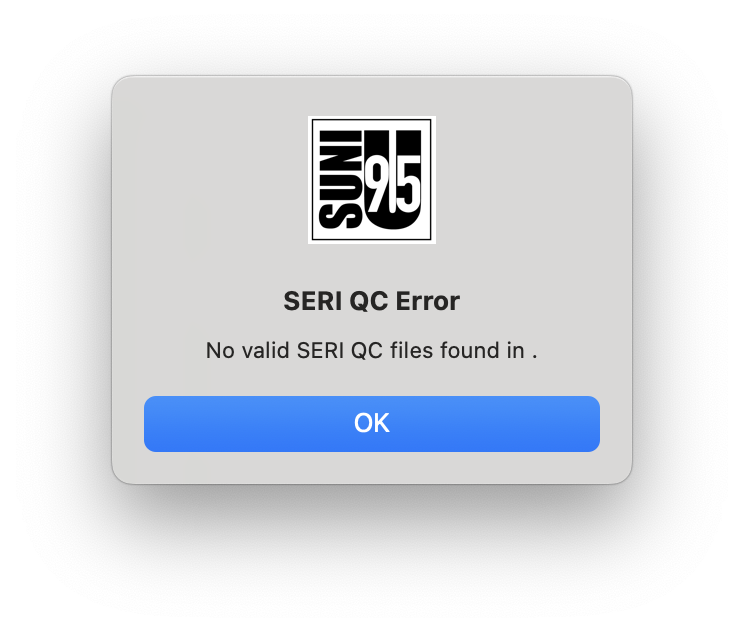
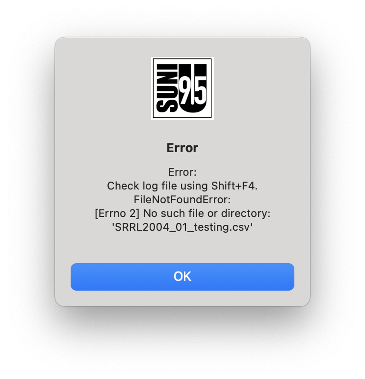
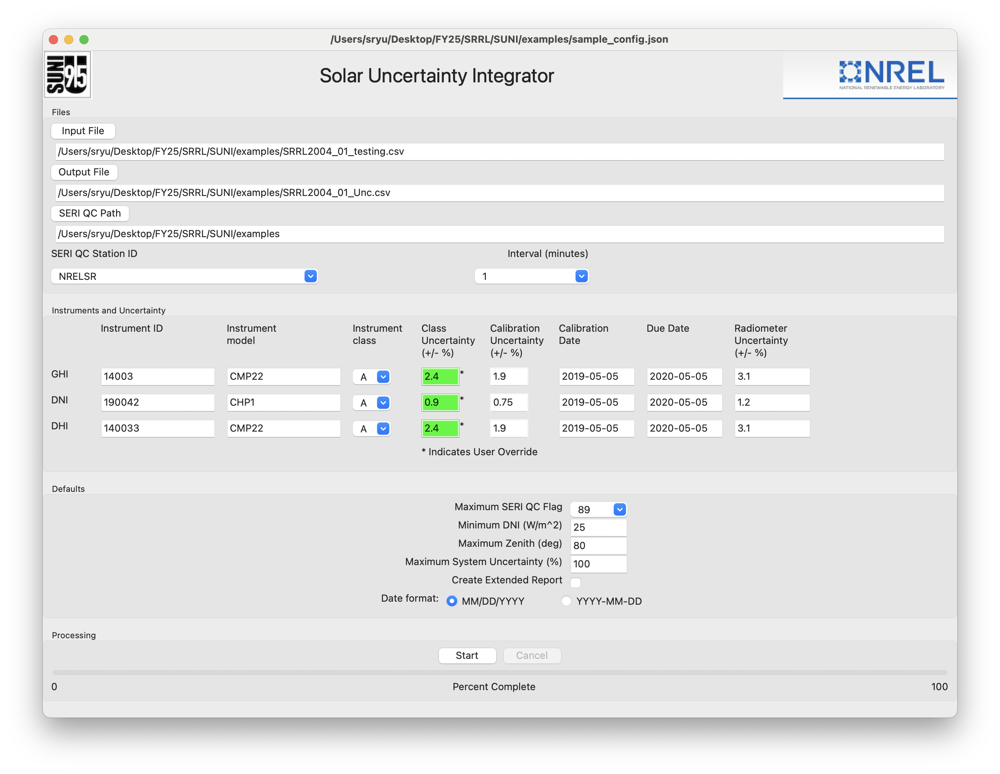
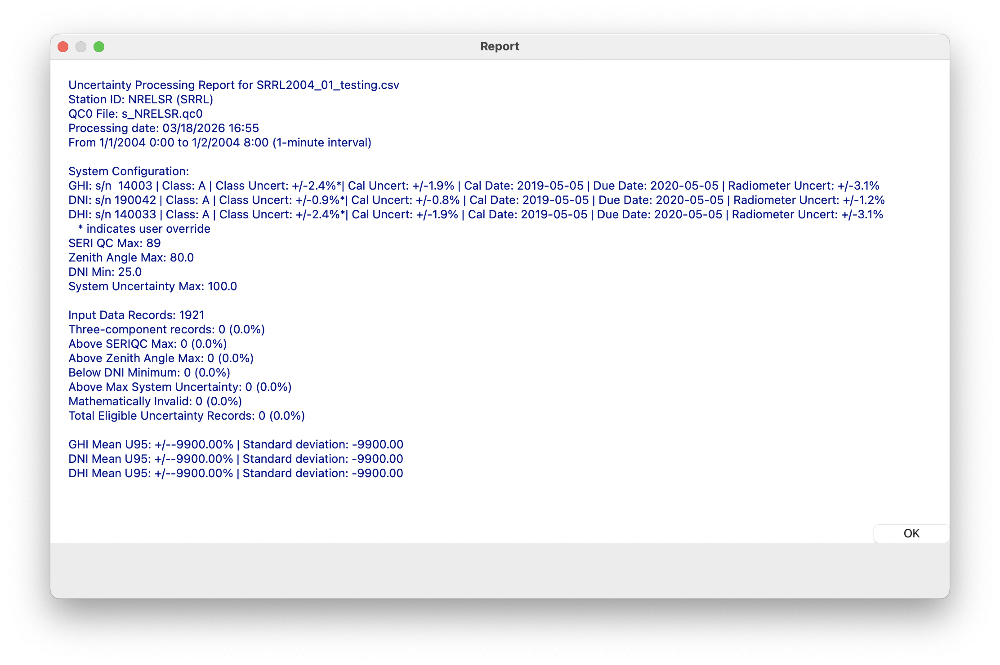

## How to Run

### Input Requirements

SUNI expects three inputs:

1. A JSON or INI configuration file
2. A solar irradiance CSV containing date/time and irradiance values
3. A SERI QC station file (`.qc0`)

See `examples/sample_config.json` for the expected configuration schema.

### CLI Workflow
Use the provided example files:

- Configuration: `examples/sample_config.json`
- Input data: `examples/SRRL2004_01_testing.csv`
- SERI QC file: `examples/s_NRELSR.qc0`

Run SUNI with:

```bash
suni examples/sample_config.json
```

The run creates:

- A processed output CSV (from the `OutputFile` value in the config)
- A text report named `<output_stem>_report.txt`

### GUI Workflow

The following walkthrough uses the example files in `examples/` and mirrors the GUI flow shown in `examples/screenshots/`.

1. Launch SUNI and open a configuration file.
	- In the application menu, select File -> Open Configuration.
	- Choose `examples/sample_config.json`.

	

2. Confirm the configuration values are populated.
	- SUNI should populate input, output, and SERI QC fields based on the configuration.
	- Verify that paths point to your local copies of the example files.

3. Resolve a missing SERI QC path warning if shown.
	- If you see a SERI QC warning, click the SERI QC Path control and select the folder containing the `.qc0` file.

	

4. Resolve a missing input file warning if shown.
	- If you see an input file warning, click the Input File control and select the irradiance CSV.

	

5. Verify corrected paths before execution.
	- Confirm Input File, Output File, and SERI QC Path are all valid.
	- Absolute paths are recommended for reliability.

	

6. Review processing options.
	- Confirm date format matches your data file.
	- Enable extended reporting if required.

7. Start processing.
	- Click Start and monitor the progress bar.
	- Typical runtime for the included example is short (often under 10 seconds, system dependent).

8. Review results.
	- A report dialog appears when processing completes.
	- The output CSV and report text file are written to the configured output location.

	

